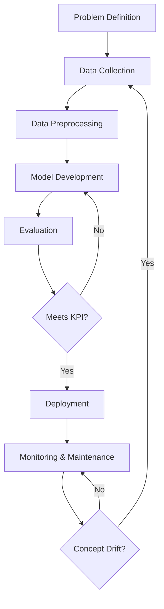

# AI Development Workflow Assignment

**Course:** AI for Software Engineering
**Topic:** Understanding the AI Development Workflow

---

## Part 1: Short Answer Questions (30 Points)

### 1. Problem Definition
**Hypothetical Problem:** Predicting Student Dropout Rates in Online Learning Platforms.

**Objectives:**
1.  **Early Intervention:** Identify at-risk students within the first 4 weeks of a course to provide targeted support.
2.  **Resource Optimization:** Allocate mentorship and tutoring resources efficiently to students who need them most.
3.  **Retention Improvement:** Increase the overall course completion rate by 15% over the next academic year.

**Stakeholders:**
1.  **Academic Administrators:** Interested in overall retention metrics and institutional reputation.
2.  **Instructors/Mentors:** Need actionable insights to intervene with specific students.

**Key Performance Indicator (KPI):**
*   **Retention Rate:** The percentage of students identified as "at-risk" who successfully complete the course after intervention.

### 2. Data Collection & Preprocessing
**Data Sources:**
1.  **Learning Management System (LMS) Logs:** Login frequency, video watch time, assignment submission timestamps, forum activity.
2.  **Student Information System (SIS):** Demographics (age, location), prior academic history, enrollment status.

**Potential Bias:**
*   **Socioeconomic Bias:** Students from lower-income backgrounds might have unstable internet connections, leading to lower "login frequency" or "time online" metrics. The model might incorrectly flag them as disengaged or low-aptitude, rather than facing technical barriers.

**Preprocessing Steps:**
1.  **Handling Missing Data:** Impute missing values for continuous variables (e.g., "average quiz score") using the median, or create a "missing" category for categorical variables.
2.  **Normalization:** Scale numerical features like "video watch time" (0-100 hours) and "quiz scores" (0-100%) to a common range (e.g., 0-1) using Min-Max Scaling to prevent features with larger magnitudes from dominating the model.
3.  **Categorical Encoding:** Convert categorical variables like "Course Category" or "Student Location" into numerical format using One-Hot Encoding.

### 3. Model Development
**Chosen Model:** **Random Forest Classifier**.
*   **Justification:** It handles non-linear relationships well (common in behavioral data), is robust to overfitting compared to a single Decision Tree, and provides feature importance scores which are crucial for explaining *why* a student is at risk.

**Data Splitting:**
*   **Training Set (70%):** Used to train the model.
*   **Validation Set (15%):** Used to tune hyperparameters and prevent overfitting during development.
*   **Test Set (15%):** Held out completely until the end to provide an unbiased evaluation of the final model's performance.

**Hyperparameters to Tune:**
1.  **`n_estimators` (Number of Trees):** Increasing this generally improves performance and stability but increases computation cost. We tune it to find the point of diminishing returns.
2.  **`max_depth`:** Controls the maximum depth of each tree. Limiting this helps prevent the model from memorizing the training data (overfitting).

### 4. Evaluation & Deployment
**Evaluation Metrics:**
1.  **Recall (Sensitivity):** The proportion of actual dropouts correctly identified. This is critical because missing an at-risk student (False Negative) means they get no help and likely drop out. We prioritize high recall.
2.  **Precision:** The proportion of predicted dropouts who actually drop out. High precision prevents wasting resources on students who don't need help (False Positives).

**Concept Drift:**
*   **Definition:** Concept drift occurs when the statistical properties of the target variable change over time. For example, if the platform introduces a new "gamification" feature, student engagement patterns might change completely, making the old model obsolete.
*   **Monitoring:** We would monitor the model's performance metrics (accuracy, recall) weekly. If performance degrades below a threshold, we trigger a retraining pipeline using the most recent data.

**Technical Challenge:**
*   **Scalability:** Processing real-time clickstream data for thousands of concurrent students can create a bottleneck. The inference service needs to be optimized (e.g., using caching or batch processing) to handle peak loads without crashing the LMS.

---

## Part 2: Case Study Application (40 Points)

### Scenario: Hospital Readmission Prediction

#### 1. Problem Scope
*   **Problem:** High rates of patient readmission within 30 days of discharge cost the hospital money (penalties) and indicate poor patient outcomes.
*   **Objective:** Predict which patients are at high risk of readmission to provide them with enhanced discharge planning and follow-up.
*   **Stakeholders:**
    *   **Hospital Administrators:** Concerned with reducing penalty costs and improving quality ratings.
    *   **Clinical Staff (Nurses/Doctors):** Need accurate alerts to prioritize discharge education and home health services.

#### 2. Data Strategy
**Data Sources:**
1.  **Electronic Health Records (EHR):** Lab results, vital signs, diagnosis codes (ICD-10), medication list.
2.  **Demographics & Social Determinants:** Age, zip code (proxy for socioeconomic status), living arrangement (alone vs. with family).

**Ethical Concerns:**
1.  **Patient Privacy (HIPAA):** Data must be de-identified or strictly access-controlled. A breach would be catastrophic.
2.  **Bias in Care:** If the model uses "insurance type" as a feature, it might bias predictions against Medicaid patients, potentially leading to different standards of care.

**Preprocessing Pipeline:**
1.  **Feature Engineering:** Create a "Comorbidity Index" score from the list of diagnosis codes. Calculate "Length of Stay" from admission/discharge dates.
2.  **Handling Imbalance:** Readmission is likely a minority class (e.g., only 15% of patients). Use techniques like SMOTE (Synthetic Minority Over-sampling Technique) to balance the training data.
3.  **Normalization:** Standardize continuous variables like "Age" and "Lab Values".

#### 3. Model Development
*   **Selected Model:** **Logistic Regression**.
*   **Justification:** In healthcare, **interpretability** is paramount. Doctors need to know *why* a patient is flagged (e.g., "High risk due to Age > 80 AND Prior Admissions > 2"). Logistic Regression provides clear odds ratios for each feature, unlike "black box" models like Deep Neural Networks.

#### 4. Deployment
**Integration Steps:**
1.  **API Development:** Wrap the model in a REST API (using Flask/FastAPI).
2.  **EHR Integration:** The hospital's EHR system triggers the API upon "Discharge Order" entry.
3.  **UI Alert:** The API returns a risk score. If High Risk, a "Readmission Alert" pop-up appears on the nurse's dashboard with recommended interventions.

**Compliance (HIPAA):**
*   **Encryption:** All data in transit (API calls) and at rest must be encrypted.
*   **Audit Logs:** Every API request must be logged (who accessed what prediction) for auditing.
*   **Minimal Access:** The API should only receive the minimum necessary fields, not the full patient history.

#### 5. Optimization
*   **Addressing Overfitting:** Use **L1/L2 Regularization** (Ridge/Lasso) in the Logistic Regression model. This penalizes large coefficients, preventing the model from becoming too complex and relying too heavily on noise in the training data.

---

## Part 3: Critical Thinking (20 Points)

### 1. Ethics & Bias
**Scenario:** The training data shows that patients from a specific zip code (associated with lower income) have higher readmission rates.
*   **Impact:** The model might learn this correlation and systematically predict "High Risk" for all patients from that zip code, or conversely, if the data is biased *against* treating them, it might predict "Low Risk" (false negative) leading to neglect. If the model uses "ability to pay" proxies, it might prioritize wealthy patients.
*   **Mitigation Strategy:** **Fairness Constraints.** During model training, we can enforce a constraint that the False Negative Rate (FNR) must be equal across all socioeconomic groups (Equalized Odds). We should also exclude explicit proxies for protected classes (like Zip Code) if they are not medically relevant, or use "Adversarial Debiasing" to remove the signal of the sensitive attribute from the latent representation.

### 2. Trade-offs
**Interpretability vs. Accuracy:**
*   **Discussion:** In healthcare, a "black box" model (like a Deep Neural Network) might achieve 95% accuracy but offer no explanation. A Logistic Regression model might only achieve 88% accuracy but provides clear odds ratios.
*   **Decision:** We prioritize **Interpretability**. A doctor cannot trust a life-altering decision to an algorithm they don't understand. If a model predicts "High Risk," the doctor needs to know it's because of "Comorbidity Index," not some opaque non-linear combination of features.

**Resource Constraints:**
*   **Impact:** If the hospital has limited computational resources (e.g., legacy on-premise servers), we cannot deploy a massive Transformer model or a complex Ensemble. We would be forced to choose a lightweight model like **Logistic Regression** or a small **Decision Tree**, which requires minimal CPU/RAM for inference.

---

## Part 4: Reflection & Workflow Diagram (10 Points)

### 1. Reflection
**Most Challenging Part:**
*   **Data Strategy & Ethics:** Defining the preprocessing pipeline while simultaneously considering ethical implications was difficult. It's easy to just "throw data at the model," but realizing that features like "Zip Code" could introduce systemic bias required careful thought and restraint.

**Improvement with More Time:**
*   **Feature Engineering:** I would consult with actual clinicians to derive more meaningful features, such as "Medication Adherence Score" or "Social Support Index," rather than relying on raw EHR fields.
*   **Model Evaluation:** I would simulate a "Shadow Deployment" phase where the model runs in the background for a month to compare its predictions against actual doctor decisions without affecting patient care.

### 2. Workflow Diagram

